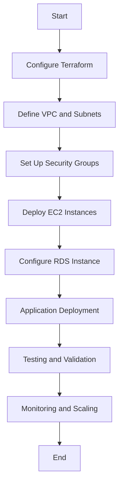

# Two-Tier AWS Infrastructure with Terraform


## Overview

This repository contains Terraform configurations to deploy a **Two-Tier Architecture** on AWS. The architecture consists of:

- **Frontend Tier**: Web servers hosted on EC2 instances within a public subnet.
- **Backend Tier**: A managed relational database service (RDS) within a private subnet.

### Key Features

- **Infrastructure as Code (IaC)**: Utilizes Terraform to define and provision AWS infrastructure.
- **Scalability**: Designed to accommodate varying loads with ease.
- **Security**: Implements best practices by segregating public and private subnets and restricting access through security groups.

---

## Project Flow



## Getting Started

Follow these steps to deploy the Two-Tier architecture:

1. **Clone the Repository:**

   ```bash
   git clone https://github.com/jaysangil/aws-2tier-infra.git
   ```

2. **Plan and Apply:**

    ```bash
    terraform init
    terraform plan -var-file=variables.tfvars
    terraform apply -var-file=variables.tfvars --auto-approve
    ```

3. **Cleanup:**
When done the exploration, run the following to destroy the infrastructure

    ```bash
    terraform destroy -var-file=variables.tfvars --auto-approve
    ```

## Project Highlights

- **VPC: The Foundation**: Create a robust Virtual Private Cloud (VPC) to establish a secure and isolated environment for your application.

- **Load Balancing Magic**: Harness the power of the Application Load Balancer (ALB) to intelligently distribute incoming traffic across multiple EC2 instances, ensuring optimal performance and high availability.

- **Auto Scaling Wonders**: Leverage the Auto Scaling Group to dynamically adjust the number of EC2 instances based on demand. This ensures your application scales seamlessly, providing resilience and cost efficiency.

- **Database Sorcery**: Dive into the world of managed databases with Amazon RDS. Easily deploy, scale, and manage relational databases without the operational overhead.

- **DNS Mastery**: Achieve domain registration and DNS management excellence with Amazon Route 53. Seamlessly connect your applications to the internet while ensuring high availability and low-latency responses.

- **Web Application Firewall (WAF) Protection**: Safeguard your applications from web exploits and ensure a secure user experience with AWS WAF, a web application firewall that helps protect your web applications from common web exploits.

- **Content Delivery Network (CDN) Acceleration**: Boost the delivery of your content globally with a Content Delivery Network. Accelerate load times, enhance user experience, and reduce latency using Amazon CloudFront.

- **SSL Certificate Management with ACM**: Ensure secure communication between your users and the application with Amazon Certificate Manager (ACM). Easily provision, manage, and deploy SSL/TLS certificates.

- **IAM for Robust Security**: Implement robust security measures with Identity and Access Management (IAM). Define granular permissions and access controls to secure your AWS resources.

- **Infrastructure as Code (IaC) Excellence**: Embrace Infrastructure as Code (IaC) with Terraform, facilitating the provisioning and management of AWS resources in a declarative and scalable manner.

These project highlights showcase the comprehensive AWS services integrated into the Two-Tier architecture, providing a solid foundation for your applications with security, scalability, and performance at the forefront.

*This project is inspired by AWS and Terraform best practices and serves as a robust foundation for scalable and secure cloud infrastructure.*